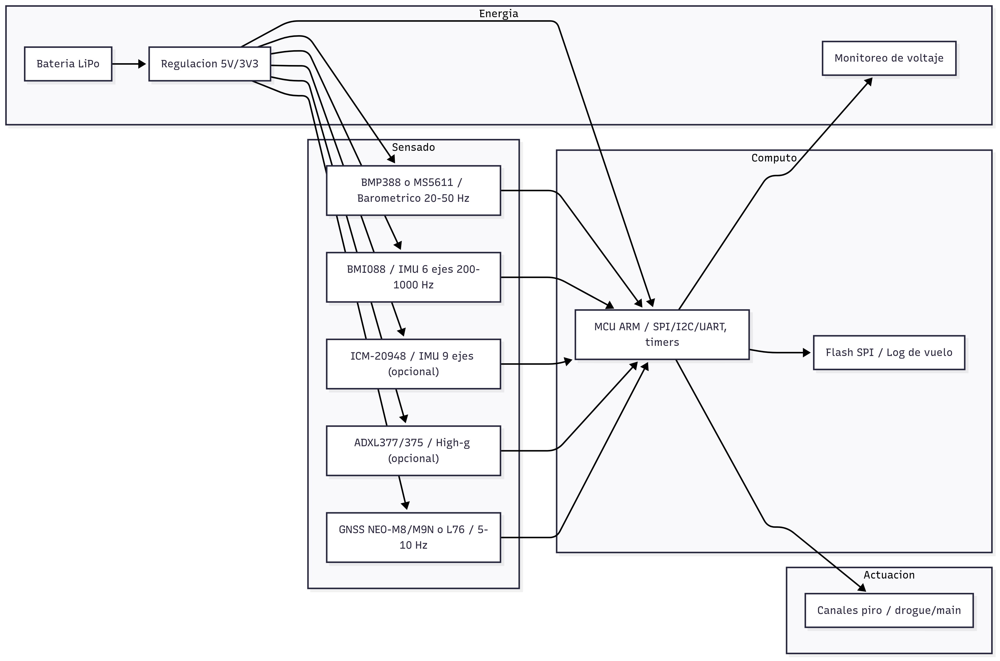

# Investigación y selección de componentes para una computadora de vuelo (SRAD)

- **Autor:** Pérez Castro Luis Ángel

## 1. Resumen

Este documento integra la **investigación y selección** de componentes para una **computadora de vuelo** (SRAD) dirigida a cohetes con apogeo **500–1000 m AGL**. Se consolidan requisitos de la actividad, criterios de diseño, diagrama de decisión, fichas técnicas por componente (con **datasheets** y alternativas), y una revisión de **computadoras comerciales** (COTS) como referencia/redundancia.

**Resultado principal (mínimo viable):** barométrico (BMP388 o MS5611) + **IMU 6 ejes** (BMI088), con **monitoreo de batería** y **continuidad piro**; **GNSS 5–10 Hz** (NEO-M8/M9N o L76) para recuperación. Si se requiere orientación, añadimos **IMU 9 ejes** (ICM-20948); si el pico de aceleración puede superar ±16 g, entonces agregamos **acelerómetro high-g** (ADXL377/375).

---

## 2. Alcance y supuestos de misión

- Cohete experimental, apogeo **500–1000 m AGL**.
- Secuencia de vuelo estándar: boost → coast → **apogeo** (drogue) → main (150–300 m AGL) → recuperación.
- **Detección de apogeo** barométrica, con **inhibiciones** (no-fire en boost, alturas/tiempos mínimos).
- Muestreos de referencia: **baro 20–50 Hz**, **inercial 200–1000 Hz**, **GNSS 5–10 Hz**.

> Referencias base (didácticas y de producto) usadas en este proyecto aparecen a lo largo del documento:
> - **NASA BGA (cohetes):** estabilidad, aerodinámica y fuerzas.
> - **PerfectFlite StratoLoggerCF:** 
>   - [Página 20 Hz](http://www.perfectflite.com/SLCF.html)
>   - [Manual PDF](http://www.perfectflite.com/Downloads/StratoLoggerCF%20manual.pdf)  
> - **Featherweight Raven (manual):** 
>   - [Manual PDF](https://www.featherweightaltimeters.com/uploads/1/0/9/5/109510427/raven_users_manual_2014may20.pdf)
> - **Featherweight Blue Raven (manual):** 
>   - [Manual PDF](https://www.apogeerockets.com/downloads/PDFs/09170-blue_raven_users_manual_september_15.pdf)

---

## 3. Requisitos de la actividad

Para **cada componente** de la computadora de vuelo, documentar:

- **Descripción y uso**
- **Rango de operación** (tensión, corriente, temperatura)
- **Requerimientos de hardware** (buses, pines, conexiones especiales)
- **Cómo se programa** (si aplica: protocolo, SDK, ejemplo mínimo)
- **Justificación** (criterios de selección y comparación)
- **Dónde conseguirlo** + **al menos una alternativa**
- **Hoja de datos (datasheet)**

Adicionalmente:
- Definir **COTS** y **SRAD**.
- Incluir **computadora de vuelo comercial** (características + compra desde México).

---

## 4. Diagrama ilustrativo



> El **árbol de decisiones** detallado se incluye en `03_arbol_decisiones_sensores.md`. Aquí se parte de sus conclusiones para justificar la selección.

---

## 5. Definiciones

### **COTS (Commercial Off-The-Shelf)**  
Equipo o componentes **comerciales** disponibles en el mercado y usados “tal cual” (sin desarrollo a medida). En ingeniería de sistemas, NASA usa COTS/GOTS/MOTS como categorías de origen y adquisición de hardware/software; buenas prácticas recientes describen cuándo y cómo emplear COTS en misiones (p. ej., “Established COTS parts” de fabricantes líderes).

**Fuentes:**
- [NASA Systems Engineering Handbook (Rev 2)](https://lws.larc.nasa.gov/pdf_files/12%20NASA_SP-2016-6105%20Rev%202.pdf)
- [NASA NTRS — Recommendations on COTS EEE Parts (2022)](https://ntrs.nasa.gov/citations/20220018183)
- [NASA/NEPP — COTS Guide (conceptos y definiciones)](https://nepp.nasa.gov/docuploads/1219C61B-7337-48C4-8760E6456F861839/COTS%20guide.pdf)

### **SRAD (Student Researched And Developed)**  
Equipo **investigado y desarrollado por estudiantes** (diseño y, en general, fabricación a cargo del equipo). En reglas de competencia se contrasta con COTS; por ejemplo, IREC define explícitamente los **sistemas de propulsión SRAD** como aquellos “diseñados y fabricados por estudiantes”, y EuRoC exige ensayos específicos para subsistemas SRAD (p. ej., computadoras de vuelo y recipientes a presión).
  
**Fuentes:**
- [IREC Rules & Requirements (2025)](https://www.soundingrocket.org/uploads/9/0/6/4/9064598/irec_rules_and_requirements_document_v_1.6_.pdf)
- [EuRoC Rules & Requirements (2023)](https://euroc.pt/wp-content/uploads/2023/03/PTS_EDU_EuRoC_ST_000454_RR_v4.1.pdf)

---

## 6. Fichas técnicas por componente

> **Formato uniforme**. Cada ficha incluye: descripción, rango, HW, programación (si aplica), justificación, proveedor/alternativa y **datasheet**.

### 6.1 Barométrico — Opción A: Bosch **BMP388**

- **Descripción / uso.** Sensor barométrico digital que mide presión atmosférica y la traduce a **altitud**; se utiliza para detectar **apogeo** y definir **ventanas de despliegue**. Operación típica de muestreo entre **20–50 lecturas por segundo** en el perfil 500–1000 m AGL.
- **Rango de operación.** Tensión nominal **3.3 V** (ver datasheet para min/max), consumo bajo; temperatura amplia.
- **Requerimientos HW.** **SPI/I²C**; orificios de presión en bahía; evitar flujo directo de gases de eyección.
- **Programación.** Utilizar la biblioteca del fabricante; inicializar el sensor, leer coeficientes de calibración, configurar la frecuencia de muestreo y los filtros digitales, y adquirir presión/temperatura para convertir a altitud.
- **Justificación.** Ofrece **resolución submétrica** (≈0.5 m típica) con **buena estabilidad térmica** gracias a un coeficiente térmico de offset (**TCO**) bajo; integra fácilmente por I²C/SPI y consume poca energía, lo que lo hace adecuado como barómetro principal.
- **Proveedor/alternativa.** Mouser/Digi-Key MX; alternativa: **MS5611**.
- **Datasheet.** [Datasheet](https://www.bosch-sensortec.com/media/boschsensortec/downloads/datasheets/bst-bmp388-ds001.pdf)

---

### 6.2 Barométrico — Opción B: TE **MS5611-01BA03**

- **Descripción / uso.** Altímetro de **muy alta resolución** (≈0.1 m típica) basado en conversión de 24 bits; idóneo para perfilar finamente el ascenso, detectar **apogeo** con poco ruido y establecer con precisión la **altitud de paracaídas principal**.
- **Rango de operación.** 3.3 V nominal (ver datasheet); consumo moderado; temperatura amplia.
- **Requerimientos HW.** **SPI/I²C**; diseño de puertos baro estable; apantallamiento básico.
- **Programación.** Seguir la secuencia indicada por el fabricante: reinicio, lectura de coeficientes de calibración, conversiones de presión y temperatura respetando los tiempos recomendados, y cálculo de presión compensada y altitud.
- **Justificación.** Es una **referencia de precisión** en el rango 0–3 km AGL; la compensación por coeficientes de fábrica reduce la deriva térmica y su documentación es amplia, facilitando una integración confiable.
- **Proveedor/alternativa.** Mouser/Digi-Key MX; alternativa: **BMP388**.
- **Datasheet.** [Datasheet](https://www.te.com/commerce/DocumentDelivery/DDEController?Action=showdoc&DocId=Data+Sheet%7FMS5611-01BA03%7FB3%7Fpdf%7FEnglish%7FENG_DS_MS5611-01BA03_B3.pdf%7FCAT-BLPS0036)

---

### 6.3 IMU 6 ejes — Bosch **BMI088**

- **Descripción / uso.** Unidad inercial de **seis ejes** (acelerómetro + giroscopio) con alta resistencia a vibraciones; permite detectar **despegue** (*liftoff*), **agotamiento del motor** (*burnout*) y caracterizar la dinámica del vuelo (aceleraciones y velocidades angulares).
- **Rango de operación.** 3.3 V nominal; rangos programables (al menos ±16 g y ±2000 °/s).
- **Requerimientos HW.** **SPI/I²C**; layout compacto, tierra sólida, desacoplos cercanos; posible montaje con **aislamiento mecánico**.
- **Programación.** Emplear la biblioteca oficial; inicializar acelerómetro y giroscopio, seleccionar rangos y tasas de actualización, activar filtros y la señal de “datos listos”, y leer periódicamente los seis canales con una calibración de cero en reposo.
- **Justificación.** Su **inmunidad a vibración** y rangos amplios minimizan saturaciones y mejoran la calidad de los datos durante el **ascenso propulsado**; es una opción sólida como núcleo inercial para cohetes de 500–1000 m con disponibilidad estable en el mercado.
- **Proveedor/alternativa.** Mouser/Digi-Key MX; alternativas: **ICM-42688-P**, **LSM6DS** (según disponibilidad).
- **Datasheet.** [Datasheet](https://www.bosch-sensortec.com/media/boschsensortec/downloads/datasheets/bst-bmi088-ds001.pdf)

---

### 6.4 IMU 9 ejes (opcional) — TDK **ICM-20948**

- **Descripción / uso.** **Acelerómetro, giroscopio y magnetómetro** con procesador digital de movimiento integrado; permite estimar **actitud** (orientación tridimensional), **inclinación** (*tilt*) y **rumbo** mediante fusión de sensores.
- **Rango de operación.** 3.3 V nominal; rangos configurables.
- **Requerimientos HW.** **SPI/I²C**; magnetómetro requiere cuidado contra corrientes parásitas/cables.
- **Programación.** Inicializar acelerómetro y giroscopio, habilitar el magnetómetro integrado, fijar tasas de actualización y aplicar un algoritmo de fusión de orientación (por ejemplo, filtro complementario) para obtener inclinación y rumbo.
- **Justificación.** Añade **observabilidad de orientación** para límites de seguridad (inclinación máxima) y análisis post-vuelo; aunque incrementa complejidad y requisitos de calibración magnética, aporta valor cuando se desea supervisar la **actitud** del vehículo.
- **Proveedor/alternativa.** Mouser/Digi-Key MX; alternativa: **ISM330 + magnetómetro externo**.
- **Datasheet.** [Datasheet](https://invensense.tdk.com/wp-content/uploads/2016/06/DS-000189-ICM-20948-v1.3.pdf)

> ***Actitud del vehículo*** significa su orientación en el espacio respecto a la Tierra (marco de referencia fijo al suelo). Se describe con tres ángulos:
> - **Cabeceo (pitch):** inclinación nariz-arriba/nariz-abajo.
> - **Alabeo (roll):** “giro de barril” alrededor del eje longitudinal.
> - **Rumbo (yaw/heading):** giro izquierda-derecha alrededor del eje vertical.

---

### 6.5 Acelerómetro **high-g** (opcional) — ADI **ADXL377 / ADXL375**

- **Descripción / uso.** Sensor de **alto rango** para registrar **picos de aceleración** durante el encendido, eventos de separación y aterrizajes duros, cuando se superan ±16 g; **ADXL377** ofrece salida analógica y **ADXL375** salida digital por SPI.
- **Rango de operación.** 3.3 V nominal; **ADXL377** analógico (±200 g), **ADXL375** digital (SPI, ±200 g).
- **Requerimientos HW.** Acondicionamiento analógico (377) o **SPI** (375); fijación rígida.
- **Programación.** Para ADXL377: muestrear con el convertidor analógico del microcontrolador y convertir la tensión a aceleración. Para ADXL375: configurar rango y velocidad de actualización y leer los tres ejes de forma continua; de forma opcional activar la detección de impactos.
- **Justificación.** Complementa a la IMU principal al **evitar saturaciones** y capturar **transitorios de alta g**, útiles para ajustar modelos de eyección y validar integridad estructural tras choques.
- **Proveedor/alternativa.** Mouser/Digi-Key MX; alternativa: **ADXL372**.
- **Datasheets.**
    - ADXL377: [Datasheet ADXL377](https://www.analog.com/media/en/technical-documentation/data-sheets/ADXL377.pdf)
    - ADXL375: [Datasheet ADXL375](https://www.analog.com/media/en/technical-documentation/data-sheets/ADXL375.pdf)

---

### 6.6 GNSS — u-blox **NEO-M8** / **NEO-M9N** (alternativa: **Quectel L76/L76-LB**)

- **Descripción / uso.** Receptor de **Sistema Global de Navegación por Satélite (GNSS)** para obtener **latitud, longitud, altitud y velocidad**; se usa para **recuperación en campo** y para validar la trayectoria estimada. Tasas típicas entre **1 y 10 lecturas por segundo**.
- **Rango de operación.** 3.3 V nominal; antena activa con **SAW+LNA** recomendada.
- **Requerimientos HW.** **UART/I²C**; plano de tierra, separación de RF respecto a piro y cables de alta corriente.
- **Programación.** En los módulos u-blox, utilizar la herramienta oficial para fijar la tasa de actualización y habilitar el mensaje de posición; en el firmware, leer y validar los mensajes del receptor y extraer latitud, longitud, altitud y velocidad. En módulos Quectel, seguir el manual de protocolo correspondiente.
- **Justificación.** Mejora sustancialmente la **recuperación** y aporta una medida independiente de **altitud/velocidad** para comparar con barómetro e inercial; **NEO-M9N** acepta cuatro constelaciones y posee funciones básicas contra **interferencia** (*jamming*) y **suplantación de señal** (*spoofing*). **L76/L76-LB** es una alternativa económica.
- **Proveedor/alternativa.** Mouser/Digi-Key MX; módulos L76/L76-LB como opción económica.
- **Datasheets/Docs.**
    * NEO-M8: [Datasheet NEO-M8](https://content.u-blox.com/sites/default/files/NEO-M8-FW3_DataSheet_UBX-15031086.pdf)
    * NEO-M9N: [Datasheet NEO-M9N]()*


---

### 6.7 Altímetros / Computadoras COTS (referencia y redundancia)

> **Objetivo:** referenciar capacidades reales de equipos comerciales (tasas, lógica piro, registro), y evaluar su **disponibilidad** para adquirir desde México.

#### PerfectFlite **StratoLoggerCF**

* **Uso:** altímetro con **20 Hz** (altitud, temperatura, voltaje), control de **drogue/main**.
* **Referencias:** 
    - [Página 20 Hz](http://www.perfectflite.com/SLCF.html)
    - [Manual PDF](http://www.perfectflite.com/Downloads/StratoLoggerCF%20manual.pdf)
* **Notas:** ejemplo de ventanas e inhibiciones; referencia para detección de apogeo barométrico.

#### Featherweight **Raven** (clásico)

* **Uso:** inercial hasta **200–400 Hz**, baro **20 Hz**; **4 salidas piro** configurables.
* **Referencias:** [Manual PDF](https://www.featherweightaltimeters.com/uploads/1/0/9/5/109510427/raven_users_manual_2014may20.pdf)
* **Notas:** muy flexible; útil como banco de comparación.

#### Featherweight **Blue Raven**

* **Uso:** inercial **500 Hz**, registro **50 Hz**, app de configuración/descarga (BLE).
* **Referencias:** [Manual PDF](https://www.apogeerockets.com/downloads/PDFs/09170-blue_raven_users_manual_september_15.pdf)
* **Notas:** ecosistema moderno; ejemplo de telemetría/app.

> **Disponibilidad en MX:** confirmar envío y tiempos con los fabricantes/distribuidores antes de la compra (costos de importación/aduana pueden aplicar).

---

## 7. Requisitos de interfaz y energía

* **Buses:** SPI (baro/IMU/flash), I²C (sensores alternos), UART (GNSS/telemetría).
* **Temporización:** timers para muestreo determinístico (200–1000 Hz inercial; 20–50 Hz baro).
* **Alimentación:** batería **LiPo**; regulación **5 V** (piro/aux) y **3.3 V** (lógica/sensores).
* **Picos piro:** dimensionar drivers (corriente y tiempo de conducción) y protecciones (TVS, fusibles, MOSFETs apropiados).
* **EMC & puesta a tierra:** planos sólidos, retorno corto, desacoplo por dispositivo, separación RF/alto-corriente.

---

## 8. Conclusiones

La arquitectura seleccionada satisface el **mínimo viable** para un perfil de 500–1000 m AGL con un balance adecuado entre **desempeño, robustez y complejidad de integración**. El conjunto barométrico (BMP388/MS5611) más **IMU de 6 ejes** (BMI088), complementado con **monitoreo de energía** y **canales pirotécnicos** con ventanas e inhibiciones, ofrece una base confiable para la **detección de apogeo** y el **control de despliegues**. La incorporación opcional de **GNSS** aporta **trazabilidad y recuperación** en campo, mientras que las extensiones con **IMU de 9 ejes** y **acelerómetro de alta g** permiten **escalar capacidades** hacia supervisión de actitud, análisis de estabilidad y captura de transitorios. Las decisiones de selección se sustentan en **prácticas comprobadas** de altímetros COTS (StratoLoggerCF, Raven, Blue Raven) y en **sensores con documentación y disponibilidad** en el mercado nacional, reduciendo riesgo técnico y logístico. En conjunto, el diseño prioriza **seguridad operativa**, **calidad de datos** y **mantenibilidad**, dejando un camino claro para iteraciones futuras.

---

## 9. Anexos

### A. Plantilla por componente

```markdown
### [Nombre del componente] — [Candidato(s)]
**Descripción / uso.**  
**Rango de operación.** [V, mA, °C]  
**Requerimientos eléctricos / conexiones.** [SPI/I²C/UART, pines, filtros, montaje]  
**Programación (si aplica).** [driver/SDK, ejemplo mínimo]  
**Justificación.** [criterios, riesgos, comparación]  
**Proveedor en MX.** [distribuidor] — **Alternativa.** [opción]  
**Datasheet.** [URL]  
**Observaciones.** [EMC, pruebas, mecánica]
```

### B. Referencias clave (enlace rápido)

* **StratoLoggerCF (20 Hz / manual):**
  - [Datasheet StratoLoggerCF](http://www.perfectflite.com/SLCF.html)
  - [Manual PDF](http://www.perfectflite.com/Downloads/StratoLoggerCF%20manual.pdf)
* **Raven (manual):** [Datasheet Raven](https://www.featherweightaltimeters.com/uploads/1/0/9/5/109510427/raven_users_manual_2014may20.pdf)
* **Blue Raven (manual):** [Blue Raven Manual](https://www.apogeerockets.com/downloads/PDFs/09170-blue_raven_users_manual_september_15.pdf)
* **BMP388 (datasheet):** [Datasheet BMP388](https://www.bosch-sensortec.com/media/boschsensortec/downloads/datasheets/bst-bmp388-ds001.pdf)
* **MS5611 (datasheet):** [Datasheet MS5611](https://www.te.com/commerce/DocumentDelivery/DDEController?Action=showdoc&DocId=Data+Sheet%7FMS5611-01BA03%7FB3%7Fpdf%7FEnglish%7FENG_DS_MS5611-01BA03_B3.pdf%7FCAT-BLPS0036)
* **BMI088 (datasheet):** [Datasheet BMI088](https://www.bosch-sensortec.com/media/boschsensortec/downloads/datasheets/bst-bmi088-ds001.pdf)
* **ICM-20948 (datasheet):** [Datasheet ICM-20948](https://invensense.tdk.com/wp-content/uploads/2016/06/DS-000189-ICM-20948-v1.3.pdf)
* **NEO-M8 (datasheet):** [Datasheet NEO-M8](https://content.u-blox.com/sites/default/files/NEO-M8-FW3_DataSheet_UBX-15031086.pdf)
* **NEO-M9N (datasheet):** [Datasheet NEO-M9N](https://content.u-blox.com/sites/default/files/NEO-M9N-00B_DataSheet_UBX-19014285.pdf)
* **Quectel L76 (HW Design):** [Datasheet Quectel L76](https://forums.quectel.com/uploads/short-url/jZHd2ObxH4FndArQyE3pqu7ZZ7e.pdf)

---

## 10. Glosario (siglas y términos clave)

- **AGL (Above Ground Level).** Altura **sobre el nivel del suelo** en el punto de lanzamiento/aterrizaje.
- **COTS (Commercial Off-The-Shelf).** Equipo comercial listo para usarse, sin desarrollo a medida.
- **SRAD (Student Researched And Developed).** Equipo investigado y desarrollado por estudiantes.
- **IMU (Inertial Measurement Unit).** Unidad inercial (acelerómetros + giroscopios; opcional magnetómetro) para medir aceleraciones y velocidades angulares.
- **GNSS (Global Navigation Satellite System).** Conjunto de sistemas satelitales de navegación (GPS, GLONASS, Galileo, BeiDou) para posición/velocidad/tiempo.
- **SPI / I²C / UART.** Buses de comunicación: **SPI** (rápido, síncrono), **I²C** (dos hilos, multidispositivo), **UART** (serie asíncrona).
- **TCO (Temperature Coefficient of Offset).** Deriva del **cero** del sensor con la temperatura; cuanto más bajo, mejor estabilidad.
- **ODR (Output Data Rate).** Frecuencia a la que un sensor entrega datos (p. ej., 200–1000 Hz en IMU).
- **OSR (Oversampling Ratio).** Sobremuestreo interno del sensor (mejora resolución/ruido a costa de tiempo).
- **SAW + LNA.** Filtro acústico superficial (**SAW**) y **amplificador de bajo ruido (LNA)** en la cadena de antena GNSS.
- **NMEA / UBX.** Formatos de mensajes GNSS: **NMEA** (estándar ASCII) y **UBX** (binario de u-blox).
- **BLE (Bluetooth Low Energy).** Enlace inalámbrico de baja energía para configuración/telemetría.
- **high-g.** Medición de **altas aceleraciones** (≈±200 g) con acelerómetros dedicados.
- **Piro / canal pirotécnico.** Salida eléctrica que enciende un **e-match** para detonar la **carga de eyección** y desplegar paracaídas.
- **Apogeo / drogue / principal.** Punto más alto del vuelo; **drogue** (paracaídas pequeño en apogeo) y **principal** (paracaídas grande a baja altitud).
- **Liftoff / burnout.** **Despegue** del cohete / **agotamiento** del propelente del motor.
- **Actitud / tilt.** **Orientación** del cohete (cabeceo, alabeo, rumbo) / **inclinación** respecto a la vertical.
- **Fusión sensorial.** Combinación de datos (IMU, baro, GNSS, etc.) para estimar estados como altitud, velocidad y orientación.
- **Ventanas de despliegue / inhibiciones.** Condiciones que **permiten** o **bloquean** eventos pirotécnicos (p. ej., no disparar en ascenso o por debajo de cierta altitud/tiempo).
